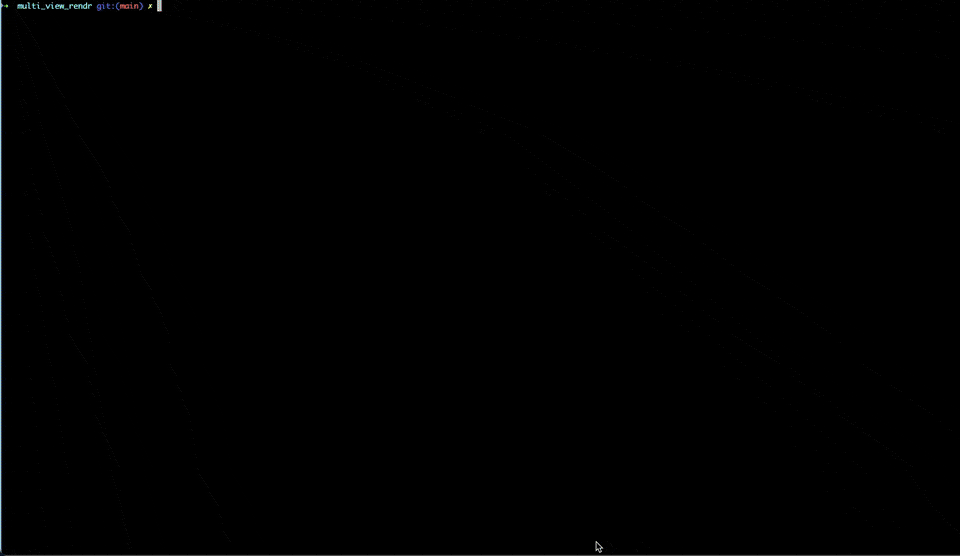

# MultiViewRenderer



## License

[](https://opensource.org/licenses/MIT)

## Note
Based on the `Open3D` codebase context,the rendering type is categorized as **ray-casting**, not ray-tracing or rasterization. 
The terminology can be confusing since `Open3D` uses Embree (a ray-tracing library) but implements ray-casting functionality. 
The key distinction lies in its application: ray-casting is used for geometric queries and volume rendering, not for photorealistic ray-tracing.

## Table of Contents
- [MultiViewRenderer](#multiviewrenderer)
  - [Table of Contents](#table-of-contents)
  - [Directory explanation](#directory-explanation)
  - [Install](#install)
  - [Usage](#usage)
    - [Example](#example)
    - [Output Files Documentation](#output-files-documentation)
      - [File Structure](#file-structure)
      - [File Details](#file-details)
        - [Color Images (`color_*.png`)](#color-images-color_png)
        - [Depth Maps (`depth_*.tiff`)](#depth-maps-depth_tiff)
        - [Camera Parameters (camera\_params.npz)](#camera-parameters-camera_paramsnpz)
        - [Configuration Log (config.log)](#configuration-log-configlog)


## Install
```
git clone https://jahad9819jjj/multi_view_rendr
cd multi_view_rendr
pip install -r requirements.txt
```

## Usage

### Example
Use [The Stanford 3D Scanning Repository](https://graphics.stanford.edu/data/3Dscanrep/)'s bunny file as an example.

```
cd multi_view_rendr/data
wget http://graphics.stanford.edu/pub/3Dscanrep/bunny.tar.gz
tar -zxvf bunny.tar.gz
python3 scripts/main.py --debug
```

### Output Files Documentation
This document explains the output files generated by the multi-view rendering pipeline.

#### File Structure

```shell
dump/
├── color_000.png # RGB color image (View 0)
├── color_001.png # RGB color image (View 1)
├── ...
├── depth_000.tiff # Depth map (View 0)
├── depth_001.tiff # Depth map (View 1)
├── ...
├── camera_params.npz # Camera parameters archive
└── config.log # Configuration log file
```

#### File Details

##### Color Images (`color_*.png`)
- **Format**: PNG (Portable Network Graphics)
- **Dimensions**: `[height]`x`[width]`x3 (RGB)
- **Content**:
  - Rendered RGB views of the point cloud from different camera angles
  - Images are saved in OpenCV's BGR color format
- **Naming Convention**:
  - `color_XXX.png` where `XXX` is 3-digit zero-padded view index
  - Example: `color_002.png` = 3rd captured view

##### Depth Maps (`depth_*.tiff`)
- **Format**: TIFF (Tagged Image File Format)
- **Dimensions**: `[height]`x`[width]` (single channel)
- **Content**:
  - 32-bit floating point depth values
  - Depth in meters from the camera plane
  - Invalid pixels marked with `0.0`
- **Usage Tips**:
  ```python
  import cv2
  depth = cv2.imread("depth_000.tiff", cv2.IMREAD_UNCHANGED)
  ```

##### Camera Parameters (camera_params.npz)

Format: NumPy compressed archive
Contents:
```shell
{
    'intrinsics': [3x3 intrinsic matrices],  # List of camera intrinsics
    'extrinsics': [4x4 extrinsic matrices]   # List of camera poses
}
```

```python
import numpy as np
data = np.load('camera_params.npz')
intrinsics = data['intrinsics']  # Shape: (N,3,3)
extrinsics = data['extrinsics']  # Shape: (N,4,4)
```

##### Configuration Log (config.log)

Format: Text file
Contents:
```txt
[Timestamp] YYYY-MM-DD HH:MM:SS
Input File: /path/to/input.ply
Output Directory: /path/to/output
Camera Configuration:
  - Resolution: 1920x1080
  - Focal Length: (1372.45, 1350.36)
  - Principal Point: (1049.30, 593.64)
View Parameters:
  - Number of Views: 12
  - View Distribution: spherical
  - Radius Range: [1.5, 2.5] meters
```